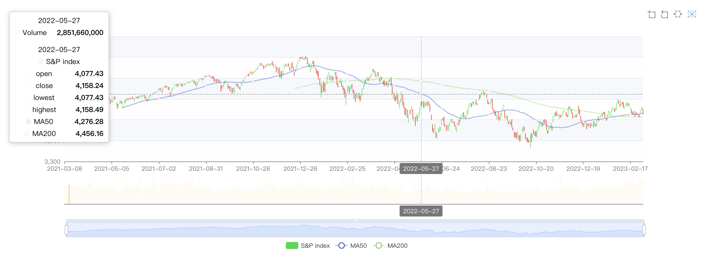

# S-P500index-js-Plot

You can interact with the figure by zoom in, zoom out,

**environment**

Language: javascript

Framework: EChart ([ref](https://echarts.apache.org/examples/en/index.html#chart-type-candlestick))

Data Api: TwelveData ([ref](https://rapidapi.com/twelvedata/api/twelve-data1/))

